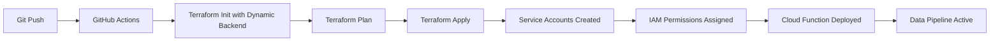

# IAM as Code Implementation Guide

## 🎯 Overview

This guide explains how the Agentic Data Science project implements complete **Infrastructure as Code (IAC)** including all IAM configurations using Terraform.

## 🏗️ Architecture Changes

### Before: Manual IAM Setup
- Manual service account creation in GCP Console
- Manual role assignments
- Hardcoded configurations
- Configuration drift over time

### After: IAM as Code
- All service accounts defined in Terraform
- All IAM permissions managed via code
- Version controlled and auditable
- Consistent across environments
- Automated service account key generation

## 📁 File Structure

```
terraform/
├── permissions/
│   └── permissions.tf          # Complete IAM configuration
├── main.tf                     # Core infrastructure
├── cloud_function.tf           # Cloud Function (updated to use managed SA)
├── backend.tf                  # Dynamic backend configuration
└── variables.tf                # Variable definitions
```

## 🔧 Implementation Details

### 1. Service Accounts (`permissions.tf`)

**GitHub Actions Service Account:**
- Purpose: Terraform deployments via CI/CD
- Permissions: Full infrastructure management
- Auto-generates JSON key for GitHub Secrets

**Cloud Function Service Account:**
- Purpose: Data processing and BigQuery operations
- Permissions: Minimal required (BigQuery + Storage)
- Used by Cloud Function for secure operations

### 2. API Management
All required Google Cloud APIs are enabled automatically:
```terraform
resource "google_project_service" "required_apis" {
  for_each = toset([
    "bigquery.googleapis.com",
    "storage.googleapis.com", 
    "cloudfunctions.googleapis.com",
    "iam.googleapis.com",
    # ... more APIs
  ])
}
```

### 3. Dynamic Backend Configuration
Backend bucket is configured dynamically:
```yaml
terraform init \
  -backend-config="bucket=${{ secrets.GCP_PROJECT_ID }}-terraform-state"
```

## 🚀 Migration Process

### Step 1: Run Migration Script
```powershell
.\scripts\migrate_to_iam_as_code.ps1 -ProjectId "your-project-id"
```

### Step 2: Local Terraform Deployment
```powershell
cd terraform
terraform init -backend-config="bucket=your-project-id-terraform-state"
terraform plan
terraform apply
```

### Step 3: Update GitHub Secrets
Use the generated `github-actions-key.json` content for the `GCP_SERVICE_ACCOUNT_KEY` secret.

### Step 4: Push to GitHub
The automated CI/CD will take over and manage everything.

## 🔐 Security Benefits

### Principle of Least Privilege
- **Cloud Function SA**: Only BigQuery data operations + Storage read
- **GitHub Actions SA**: Full infrastructure management (required for Terraform)

### Audit Trail
- All IAM changes tracked in Git
- Terraform state shows current permissions
- No manual configuration drift

### Automated Key Rotation
- Service account keys generated fresh on each deployment
- Old keys automatically cleaned up
- No long-lived credentials in GitHub

## 📊 IAM Permissions Matrix

| Service Account | Role | Purpose |
|---|---|---|
| `github-actions-terraform` | `bigquery.admin` | Create/manage datasets |
| `github-actions-terraform` | `storage.admin` | Manage buckets and objects |
| `github-actions-terraform` | `cloudfunctions.admin` | Deploy Cloud Functions |
| `github-actions-terraform` | `iam.serviceAccountAdmin` | Manage service accounts |
| `cloud-function-bigquery` | `bigquery.dataEditor` | Load data to BigQuery |
| `cloud-function-bigquery` | `storage.objectViewer` | Read CSV files from bucket |

## 🔄 Continuous Deployment Flow



## 🛡️ Best Practices Implemented

1. **Separation of Concerns**: Infrastructure and application permissions separated
2. **Version Control**: All IAM in Git with proper review process
3. **Automated Testing**: Terraform validate ensures configuration correctness
4. **Resource Dependencies**: Proper `depends_on` relationships prevent race conditions
5. **Idempotency**: Multiple runs produce same result
6. **Cleanup**: Automated resource cleanup when destroyed

## 🔍 Monitoring & Verification

### Check Service Accounts
```bash
gcloud iam service-accounts list
```

### Verify Permissions
```bash
gcloud projects get-iam-policy PROJECT_ID
```

### Monitor Terraform State
```bash
terraform state list
terraform show
```

## 🎯 Benefits Achieved

✅ **Consistency**: Same IAM across all environments  
✅ **Security**: Minimal required permissions only  
✅ **Auditability**: All changes tracked in Git  
✅ **Automation**: No manual IAM configuration needed  
✅ **Scalability**: Easy to replicate across projects  
✅ **Compliance**: Infrastructure as Code best practices  

---

**Status**: ✅ **IAM as Code IMPLEMENTED**  
**Next**: Configure GitHub Secrets and deploy! 🚀
