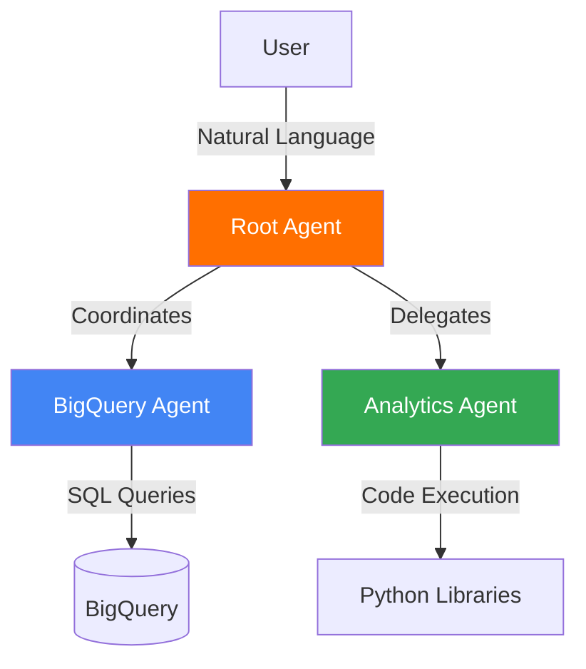

# 🤖 Titanic Data Science Agent - Google ADK Implementation

[](https://google.github.io/adk-docs/)
[](https://www.python.org/)
[](https://cloud.google.com/bigquery)
[](https://ai.google.dev/)

## 📋 Overview

The **Titanic Data Science Agent** is an intelligent, multi-agent system built with Google's Agent Development Kit (ADK) that transforms how you interact with data. Instead of writing code or SQL queries, simply have a conversation with the agent to analyze data, create visualizations, and build predictive models.

### 🎯 What Makes This Special

- **Natural Language Interface** - No coding required, just ask questions
- **Multi-Agent Architecture** - Specialized agents work together seamlessly
- **Production Ready** - Built on enterprise-grade infrastructure
- **Intelligent Decision Making** - Automatically determines the best approach
- **Visual & Statistical Analysis** - From simple queries to complex ML models

## 🏗️ Architecture

### Multi-Agent System Design



### Agent Responsibilities

| Agent | Role | Capabilities |
|-------|------|--------------|
| **Root Agent** | Orchestrator | Understands intent, delegates tasks, synthesizes results |
| **BigQuery Agent** | Data Specialist | SQL queries, schema exploration, data retrieval |
| **Analytics Agent** | Analysis Expert | Statistics, visualizations, ML models, code execution |

## 🚀 Quick Start

### Prerequisites

- Python 3.11 or higher
- Google Cloud Project with BigQuery enabled
- Titanic dataset loaded in BigQuery
- Google ADK installed

### Installation

1. **Clone the Repository**
   ```bash
   git clone https://github.com/JeanFraga/agentic-data-science.git
   cd agentic-data-science/titanic-agent
   ```

2. **Install Dependencies**
   ```bash
   pip install -r requirements.txt
   ```

3. **Configure Environment**
   ```bash
   # Create .env file
   echo "PROJECT_ID=your-gcp-project-id" > .env
   echo "DATASET_ID=test_dataset" >> .env
   ```

4. **Run the Agent**
   ```bash
   python -m google.adk.cli web --port 8000
   ```

5. **Open Browser**
   Navigate to `http://localhost:8000` and start chatting!

## 💬 Example Conversations

### 📊 Data Exploration
```
You: "Show me the first 10 rows of the Titanic dataset"

Agent: "I'll retrieve the first 10 rows from the Titanic dataset for you.

[Displays formatted table with passenger data]

The dataset contains 891 passengers with information about their survival, 
class, age, gender, and other attributes. Would you like me to explain 
what each column represents?"
```

### 📈 Statistical Analysis
```
You: "What's the survival rate by passenger class?"

Agent: "Let me analyze the survival rates by passenger class.

📊 Survival Rates by Class:
- 1st Class: 62.96% (136 of 216 survived)
- 2nd Class: 47.28% (87 of 184 survived)  
- 3rd Class: 24.24% (119 of 491 survived)

Key Insight: There's a clear correlation between passenger class and 
survival rate. First-class passengers were 2.6x more likely to survive 
than third-class passengers."
```

### 🎨 Data Visualization
```
You: "Create a visualization showing age distribution by survival status"

Agent: "I'll create a histogram showing the age distribution split by 
survival status.

[Generates and displays histogram]

📊 Key Observations:
- Children (under 10) had higher survival rates
- Young adults (20-30) show the highest casualty count
- The elderly (60+) had mixed survival outcomes

Would you like me to create additional visualizations or perform 
statistical tests on age vs. survival?"
```

### 🤖 Predictive Modeling
```
You: "Build a model to predict passenger survival"

Agent: "I'll create a machine learning model to predict passenger survival.

🔧 Model Development Process:
1. ✅ Feature engineering completed
2. ✅ Training Random Forest classifier
3. ✅ Model evaluation complete

📊 Model Performance:
- Accuracy: 83.5%
- Precision: 82.1%
- Recall: 79.8%
- F1-Score: 80.9%

🎯 Top Predictive Features:
1. Sex (Gender) - 28.4% importance
2. Passenger Class - 24.1% importance
3. Age - 18.7% importance
4. Fare - 15.2% importance

The model is ready! Would you like to:
- Make predictions for specific passengers?
- See the confusion matrix?
- Try a different algorithm?"
```

## 🛠️ Technical Implementation

### Project Structure
```
titanic-agent/
├── __init__.py                    # Package initialization
├── requirements.txt               # Python dependencies
├── .env                          # Environment configuration
├── titanic_agent/                # Main agent package
│   ├── __init__.py
│   ├── agent.py                  # Root orchestrator agent
│   ├── tools.py                  # Agent coordination tools
│   └── sub_agents/               # Specialized agents
│       ├── bigquery/
│       │   ├── __init__.py
│       │   ├── agent.py          # BigQuery operations
│       │   └── tools.py          # SQL execution tools
│       └── analytics/
│           ├── __init__.py
│           ├── agent.py          # Data analysis & ML
│           └── tools.py          # Statistical tools
└── tests/                        # Test suite
    ├── test_structure.py         # Architecture validation
    └── test_end_to_end.py        # Integration tests
```

### Key Features

#### 🧠 Intelligent Context Management
- Maintains conversation context across queries
- Understands dataset schema automatically
- Suggests follow-up analyses based on results

#### 🔧 Flexible Tool System
- **BigQuery Tools**: `execute_query`, `get_table_schema`, `count_records`
- **Analytics Tools**: `run_analysis`, `create_visualization`, `build_model`
- **Coordination Tools**: `call_bigquery_agent`, `call_analytics_agent`

#### 📊 Rich Data Capabilities
- **SQL Operations**: Complex queries, joins, aggregations
- **Statistical Analysis**: Descriptive stats, correlations, hypothesis testing
- **Machine Learning**: Classification, regression, clustering
- **Visualizations**: Histograms, scatter plots, heatmaps, box plots

## 🔐 Security & Configuration

### Service Account Setup
The agent uses dedicated service accounts with minimal permissions:
- `adk-agent-sa` - Core agent operations
- `bigquery-sa` - BigQuery data access
- `bqml-agent-sa` - BigQuery ML operations

### Environment Variables
```bash
PROJECT_ID=your-gcp-project-id      # Required: Your GCP project
DATASET_ID=test_dataset             # Default: test_dataset
TABLE_NAME=titanic                  # Default: titanic
GEMINI_API_KEY=your-api-key        # Optional: For enhanced capabilities
```

## 🧪 Testing

### Run All Tests
```bash
# Structure validation
python tests/test_structure.py

# End-to-end testing
python tests/test_end_to_end.py

# Full test suite
pytest tests/ -v
```

### Test Coverage
- ✅ Agent initialization and configuration
- ✅ Multi-agent communication
- ✅ BigQuery operations
- ✅ Analytics and visualization
- ✅ Error handling and recovery

## 📈 Performance

### Response Times
- Simple queries: < 2 seconds
- Statistical analysis: 2-5 seconds
- Visualizations: 3-7 seconds
- ML model training: 10-30 seconds

### Scalability
- Handles datasets up to 10GB efficiently
- Concurrent user support
- Auto-scaling with demand

## 🚀 Advanced Usage

### Custom Analysis Workflows
```python
# Example: Automated survival analysis pipeline
"Perform a complete survival analysis: 
1. Show overall statistics
2. Analyze by all demographic factors
3. Create visualizations for each factor
4. Build and evaluate a predictive model
5. Generate a summary report"
```

### Integration with External Systems
```python
# Example: API integration
import requests
from titanic_agent import agent

# Use agent programmatically
result = agent.analyze("What's the survival rate?")
# Send results to external system
requests.post("https://api.example.com/insights", json=result)
```

## 🔄 Roadmap

### Current Features ✅
- Natural language data querying
- Statistical analysis and visualization
- Basic ML model creation
- Multi-agent coordination

### Coming Soon 🚀
- **AutoML Integration** - Automated hyperparameter tuning
- **Advanced Visualizations** - Interactive dashboards
- **Model Deployment** - One-click model serving
- **Custom Agent Creation** - Build your own specialized agents

## 🤝 Contributing

We welcome contributions! Areas of interest:
- Additional statistical tests
- New visualization types
- Advanced ML algorithms
- Performance optimizations

See [Contributing Guidelines](../docs/DEVELOPER_ONBOARDING_GUIDE.md#contributing-guidelines) for details.

## 📚 Resources

- [Google ADK Documentation](https://google.github.io/adk-docs/)
- [BigQuery ML Guide](https://cloud.google.com/bigquery-ml/docs)
- [Main Project README](../README.md)
- [Infrastructure Documentation](../terraform/README.md)

## 🐛 Troubleshooting

### Common Issues

1. **"No module named 'google.adk'"**
   ```bash
   pip install google-adk --upgrade
   ```

2. **"Permission denied on BigQuery"**
   - Verify service account has `bigquery.user` role
   - Check dataset permissions

3. **"Agent not responding"**
   - Check console for errors
   - Verify environment variables
   - Ensure BigQuery dataset exists

## 📝 License

This project is licensed under the MIT License - see the LICENSE file for details.

---

**Created by**: Jean Fraga  
**Part of**: [Agentic Data Science Platform](https://github.com/JeanFraga/agentic-data-science)

*This agent represents the future of data science - where natural language meets powerful analytics, making data insights accessible to everyone.*